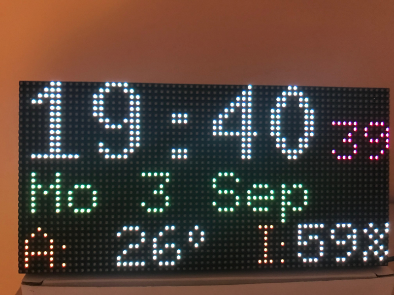
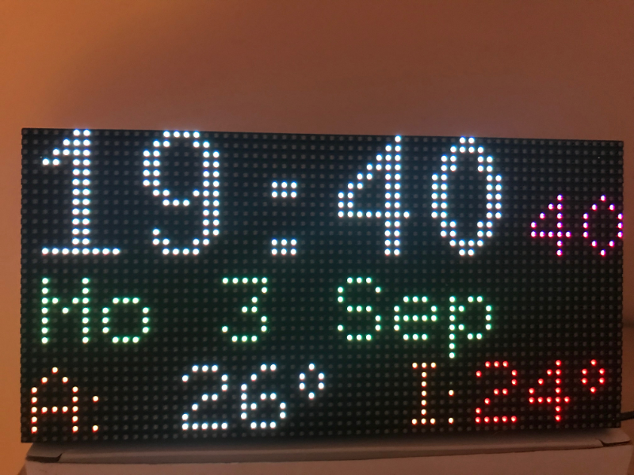
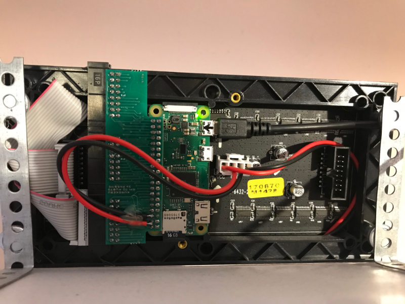
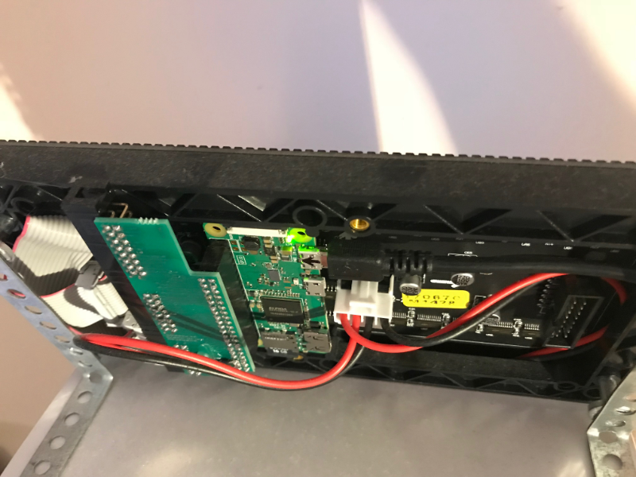

# led-wall-clock-iobroker
A RGB LED matrix wall clock controlled by a Raspberry Pi.
Modified original project from jeffkub - removed temperature and humidity retrieval from a Internet site and changed to retrieval from my local ioBroker smarthome platform (https://iobroker.com). Localisation: changed the clock format to 24H, temperature to Celsius.
The LOCALE setting of the Raspberry is used for the date display language.
Using the WiFi module of the "RPi Zero W" for the network / Internet connection.
Display color of temperature / humidity is changing depending from their values (values out of "healthy" range --> red color).
Dimming is based on Sunset/Sunrise at your location.



# Configuration
## weather.py
Fetch data (temperature ...) from ioBroker and write to variables
## dimmer.py
Set location (coordinates) and high/low brightness level 
## display.py
Define what to be shown and where at the LED Matrix Display

# Parts List 
- 64x32 RGB LED Matrix - 3mm pitch (https://www.amazon.de/dp/B01ET1QNR4/ref=pe_3044161_185740101_TE_item)
- RPI to HUB75 LED panel adapter kit (http://www.kurokesu.com/shop/led_panels/RPI-HUB75-P-3)
- Raspberry Pi Zero WH (https://buyzero.de/products/raspberry-pi-zero-w?variant=32929081170)

# Dependencies
Linux Platform (Raspian Lite). The actual edition is Buster
- NTP client daemon needs to be installed+enabled for automatic time sync.
```
apt install ntp
```
Python libraries
- [rpi-rgb-led-matrix](https://github.com/hzeller/rpi-rgb-led-matrix)
- requests
- apscheduler
- daemonify

ioBroker adapters (https://iobroker.com/)
- iobroker.simple-api
- iobroker.web (required by simple-api)


# RGB Matrix Library Build Instructions
Clone this repository and submodules to your Raspberry Pi
```
apt install git python-dev python-pip
cd /opt
git clone --recursive https://github.com/gituser-rk/led-wall-clock-iobroker.git
cd led-wall-clock-iobroker/rpi-rgb-led-matrix
```

Build and install the Python library
```
make build-python
sudo make install-python
sudo pip install daemonify requests apscheduler ephem
```
# Starting the Clock
To start the clock for testing
```
cd /opt/led-wall-clock-iobroker
sudo ./ledclock.py
```
To start the clock as a daemon
```
cd /opt/led-wall-clock-iobroker
sudo ./ledclock.py -d start
```
# Autostart
I've created a Systemd service unit file "ledclock.service". Here is how to install and activate the service:
```
cd /opt/led-wall-clock-iobroker
cp ledclock.service /etc/systemd/system/
chmod 644 /etc/systemd/system/ledclock.service
systemctl daemon-reload
systemctl enable ledclock.service
systemctl start ledclock.service
```




# To Do
- Move configuration to a separate file
- Implement dimming based on some I2C ambient light sensor
